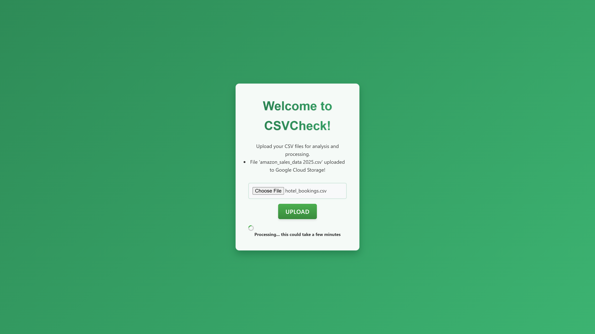
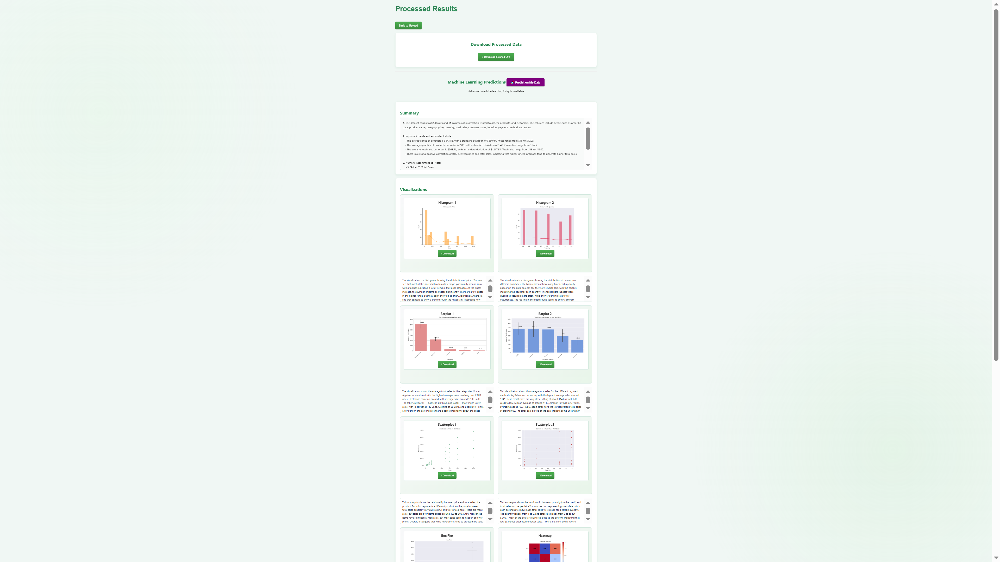
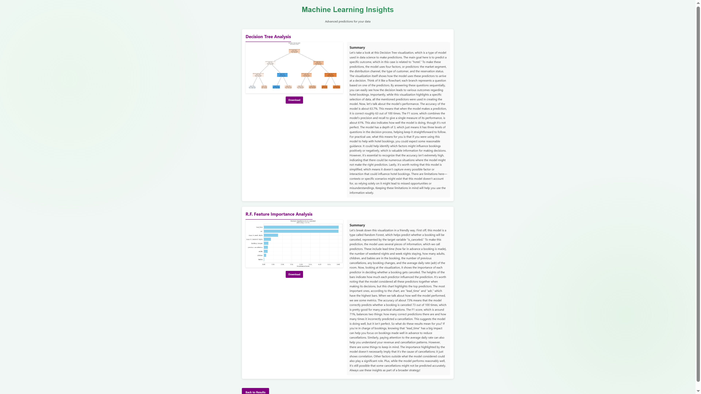

# CSV Check

**Cloud-Based Analytics Application**  
**CSV Check – Data Visualization for Inexperienced Users**

CSV Check is a lightweight, cloud-powered tool designed to help everyday users explore and understand their data. By simply uploading a CSV file, users receive cleaned data, automatically generated visualizations, and simplified AI-generated summaries — no technical knowledge required.

---

## 🚀 What It Does

- Upload a CSV file
- Automatically clean and process the data
- Generate visual summaries with plots
- Get plain-English explanations of insights
- View basic machine learning predictions (if applicable)

CSV Check aims to **bridge the gap between complex data tools and non-technical users**, providing insights through automation and clarity.

---

## 🌐 About This Repository

> **Important Note**  
> This repository only contains the **frontend and application-facing code** (Flask app, routing, HTML/CSS templates).  
> The cloud infrastructure (Google Cloud Functions, API calls, and backend logic) is **not included here**.

This means you're seeing the interface and local structure that connects to the cloud, not the full cloud processing logic itself.

---

## 🖼️ Screenshots & Previews

Below are some example screenshots of the application in use. *(Replace the placeholders with actual image links or file paths once uploaded to the repo.)*

### 📊 Upload and Analysis Interface

### 📈 Sample Visualization Output

### 🤖 Sample Machine Learning Output

---

## 🧠 Tech Stack

- **Python** (Flask)
- **HTML/CSS** for basic UI
- **Google Cloud Storage** – For uploading and retrieving user files
- **Google Cloud Functions** – For processing CSV files serverlessly
- **OpenAI API** – For generating human-friendly summaries and insights
- **Pandas / Matplotlib / Seaborn / Scikit-learn** – For data processing and visualizations

---

## 📁 File Structure (Partial)

csvCheck/
├── static/
│ └── css/
│ └── style.css
├── templates/
│ ├── index.html
│ ├── result.html
├── app.py
└── README.md

---

## ✍️ Author

**Dylan Stewart**  
Master's in Computer Science  
Hofstra University

---

## 📌 Future Plans

- Add user-specified visualization options
- Processing speed enhancements
- Offer increased handling for dealing with very large file sizes
- Include more interactive plots

---

## 📬 Feedback

Have suggestions or want to contribute? Feel free to open an issue or reach out via email.

---
